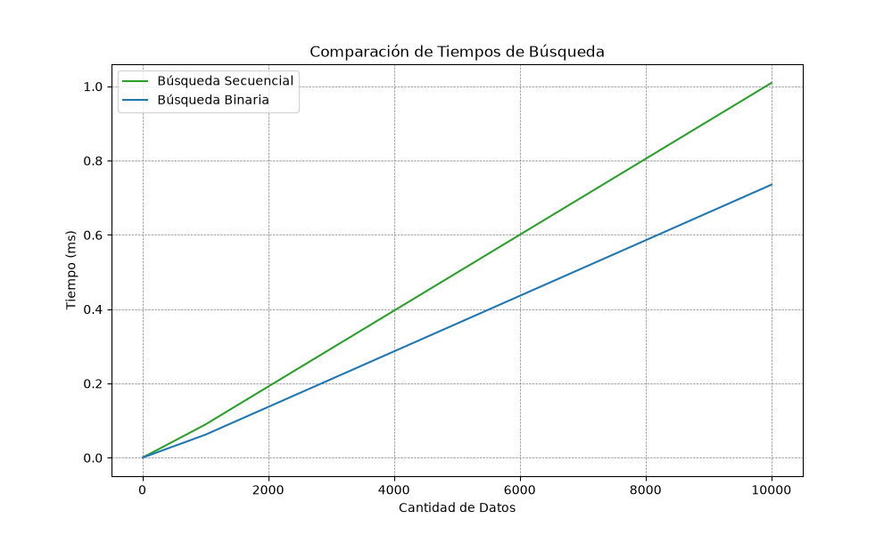

# TP2 — Análisis de complejidad

## 1. Operación crítica elegida
Búsqueda por nombre en el catálogo. [Por qué: es la que el usuario ejecuta más; es la que después va a resolver el árbol.]

## 2. Estrategias comparadas
| ID | Estrategia | Implementación |
|---|---|---|
| A | Secuencial | `Catalogo.buscar` (TP1) |
| B | Binaria | `Catalogo.buscar_binaria` (`bisect`, lista ordenada) |

## 3. Datos de prueba
Datasets sintéticos de 100, 1.000, 10.000 y 100.000 elementos.
Generador: `datos/generar.py`.

## 4. Método de medición
`timeit`, 20 ejecuciones x 5 repeticiones, me quedo con el mínimo por llamada.
Script: `algoritmos/experimentos/medicion.py`.

## 5. Resultados

| Tamaño de la Muestra | Búsqueda secuencial (ms) | Búsqueda binaria (ms) |
|----------------------|--------------------------|-----------------------|
| 10                   | 0.0010                   | 0.0008                |
| 100                  | 0.0088                   | 0.0061                |
| 1000                 | 0.0892                   | 0.0618                |
| 10000                | 1.0093                   | 0.7352                |

## 6. Análisis de complejidad
| Estrategia                         | Peor caso O() | Mejor caso Ω()      | Caso típico Θ() (listas chicas) |
|------------------------------------|---------------|---------------------|---------------------------------|
| Secuencial (buscar)                | O(n)          | Ω(1) (está primero) | Proporcional a n/2 promedio     |
| Binaria (buscar_binaria)           | O(log n)      | Ω(1)                | Θ(log n)                        |
| Ordenar antes de binaria (una vez) | O(n log n)    | Ω(n log n)          | Pagado una vez, amortizado      |

TEXTO DE EJEMPLO: "La búsqueda secuencial recorre la lista hasta encontrar el elemento: en el peor caso recorre los n
elementos (O(n)). La búsqueda binaria descarta la mitad del espacio en cada paso: a lo sumo
log2(n) comparaciones (O(log n)), pero requiere que la lista esté ordenada (O(n log n) al
cargar, una sola vez)."
⚠ No escribas complejidades a ojo: la parte más floja de una defensa es decir O(log n) de una
estructura mal implementada. Medí y que los números te den la razón.

## 7. Conclusión

1. Qué se comparó (misma operación, mismos datos, mismas condiciones).
2. Qué dice la tabla (cuando n crece 10x, la secuencial crece ~10x; la binaria casi no).
3. Por qué (complejidad asintótica: O(n) vs O(log n); se explica con la tabla).
4. Cuál conviene y por qué (en este caso binaria/árbol para búsquedas frecuentes; pero secuencial es
más simple si la lista es chica o muta mucho, porque ordenar también cuesta).
5. Qué se aprende del experimento (y nota al margen: con 100 elementos las dos "andan igual", y
eso también es un dato).