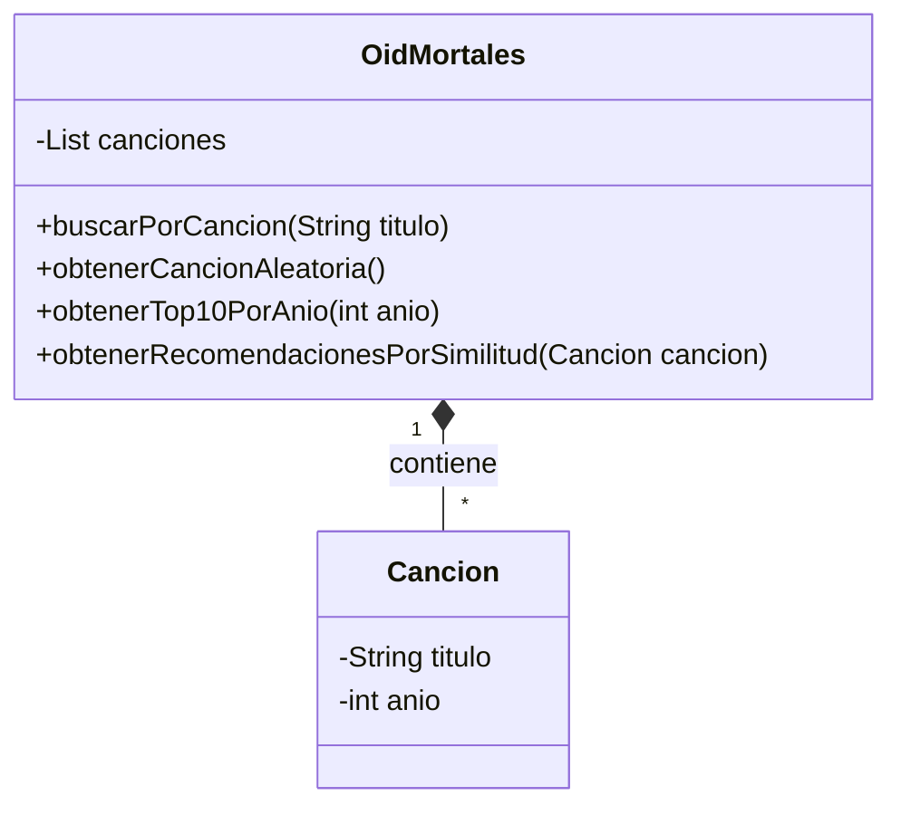

```mermaid
classDiagram
    class OidMortales {
        -List canciones
        +buscarPorCancion(String titulo)
        +obtenerCancionAleatoria()
        +obtenerTop10PorAnio(int anio)
        +obtenerRecomendacionesPorSimilitud(Cancion cancion)
    }

    class Cancion {
        -String titulo
        -int anio
    }

    OidMortales "1" *-- "*" Cancion : contiene
```

