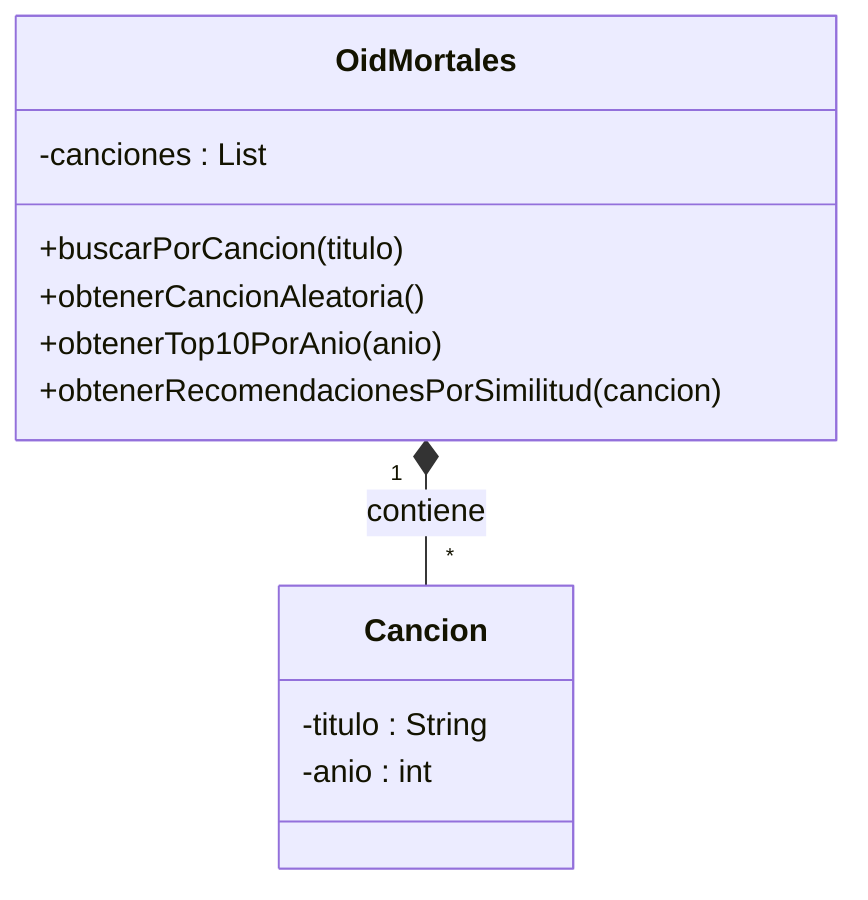

```mermaid
classDiagram
    class OidMortales {
        -canciones : List
        +buscarPorCancion(titulo)
        +obtenerCancionAleatoria()
        +obtenerTop10PorAnio(anio)
        +obtenerRecomendacionesPorSimilitud(cancion)
    }

    class Cancion {
        -titulo : String
        -anio : int
    }

    OidMortales "1" *-- "*" Cancion : contiene
```

